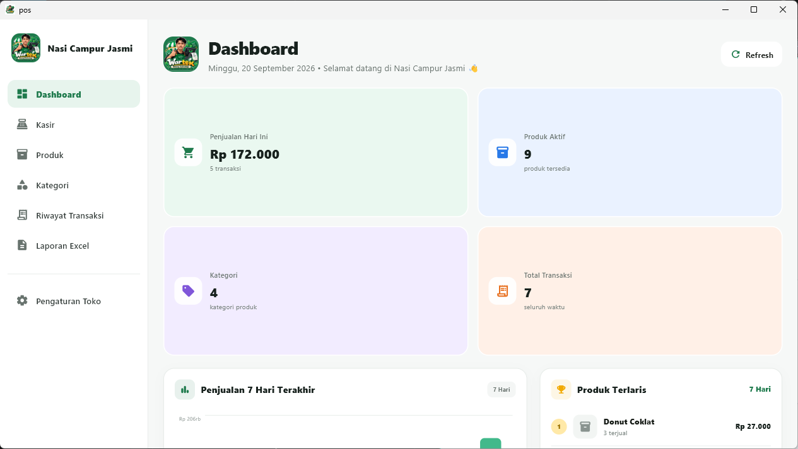
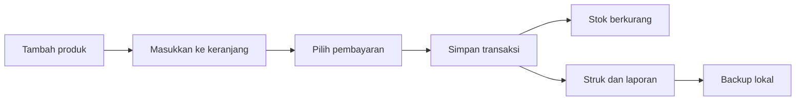

<div align="center">


# POS UMKM Offline

**Aplikasi kasir offline yang ringan, modern, dan siap dipakai UMKM.**

Kelola produk, stok, transaksi, pembayaran, laporan, dan cetak struk
tanpa bergantung pada koneksi internet.

<p>
  <a href="https://github.com/arjunsujarwo/pos-umkm-offline-flutter/releases/latest">
    
  </a>
  
  
</p>

<p>
  <a href="https://github.com/arjunsujarwo/pos-umkm-offline-flutter/releases/latest">Download aplikasi</a>
  &nbsp;&bull;&nbsp;
  <a href="https://github.com/arjunsujarwo/pos-umkm-offline-flutter/issues">Laporkan masalah</a>
</p>

</div>

## Lihat aplikasinya



> Screenshot di atas diambil langsung dari build Windows aplikasi. Antarmuka
> responsif dan menyesuaikan desktop, tablet, maupun ponsel.

## Download

| Platform | File | Link |
| --- | --- | --- |
| Windows 10/11 64-bit | ZIP portable | [Download Windows](https://github.com/arjunsujarwo/pos-umkm-offline-flutter/releases/latest/download/wartek-windows.exe.zip) |
| Android phone/tablet | APK release | [Download Android](https://github.com/arjunsujarwo/pos-umkm-offline-flutter/releases/latest/download/app-release.apk) |

### Instalasi singkat

- **Windows:** download ZIP, extract seluruh folder, lalu jalankan file `.exe`.
- **Android:** download APK, izinkan instalasi dari sumber ini jika diminta,
  lalu buka file APK.

Data disimpan lokal di perangkat. Gunakan menu **Pengaturan Toko > Data dan
Backup** untuk membuat cadangan sebelum memindahkan atau menghapus aplikasi.

## Fitur utama

<table>
  <tr>
    <td width="50%">
      <h3>Kasir & transaksi</h3>
      <ul>
        <li>Katalog produk dengan pencarian real-time.</li>
        <li>Keranjang, diskon, nominal tunai, dan kembalian.</li>
        <li>Detail transaksi dan cetak ulang struk.</li>
        <li>Pembatalan transaksi mengembalikan stok.</li>
      </ul>
    </td>
    <td width="50%">
      <h3>Produk & inventori</h3>
      <ul>
        <li>Kategori dan foto produk.</li>
        <li>Validasi stok saat checkout.</li>
        <li>Riwayat mutasi stok.</li>
        <li>Dashboard produk terlaris dan penjualan.</li>
      </ul>
    </td>
  </tr>
  <tr>
    <td>
      <h3>Pembayaran</h3>
      <ul>
        <li>Tunai dan QRIS.</li>
        <li>Upload gambar QR atau gunakan data QR/URL.</li>
        <li>Multi-rekening bank untuk transfer.</li>
      </ul>
    </td>
    <td>
      <h3>Operasional toko</h3>
      <ul>
        <li>Laporan penjualan Excel.</li>
        <li>Pilih printer dan cetak struk.</li>
        <li>Backup dan restore database lokal.</li>
        <li>Navigasi desktop dan mobile yang responsif.</li>
      </ul>
    </td>
  </tr>
</table>

## Cara kerja



## Teknologi

- **Flutter** untuk satu codebase multi-platform.
- **Dart** untuk logika aplikasi.
- **Provider** untuk state management.
- **SQLite / sqflite** untuk penyimpanan offline.
- **PDF + Printing** untuk struk dan printer sistem.
- **Excel Plus** untuk ekspor laporan.

## Menjalankan project

### Prasyarat

- Flutter SDK
- Android Studio atau Visual Studio dengan workload Desktop C++
- Android device/emulator untuk build Android

### Development

```bash
flutter pub get
flutter analyze
flutter run -d windows
```

Untuk Android:

```bash
flutter devices
flutter run -d <device-id>
```

### Build release

```bash
flutter build windows --release
flutter build apk --release
```

## Struktur project

```text
lib/
├── data/       # Database SQLite dan migrasi
├── models/     # Model produk, transaksi, dan pengaturan
├── providers/  # State management
├── screens/    # Halaman UI aplikasi
├── services/   # Cetak, backup, dan laporan
├── utils/      # Helper format dan utilitas
└── widgets/    # Komponen UI bersama
```

## Catatan offline & privasi

POS UMKM tidak mengirim data transaksi ke server. Database, pengaturan toko,
dan backup berada di perangkat pengguna. Karena itu:

- Data antarperangkat tidak tersinkronisasi otomatis.
- Backup perlu dilakukan secara berkala.
- Restore menggantikan database aktif dan aplikasi perlu dibuka ulang.
- Integrasi printer Bluetooth/USB ESC-POS khusus dapat ditambahkan di tahap
  berikutnya.

## Kontribusi

1. Fork repository ini.
2. Buat branch fitur: `git checkout -b fitur/nama-fitur`.
3. Jalankan `flutter analyze` sebelum commit.
4. Buat pull request dengan deskripsi perubahan yang jelas.

## Lisensi

Silakan tambahkan lisensi yang sesuai sebelum mendistribusikan project ini
secara luas.

<div align="center">

**Dibuat untuk membantu UMKM berjualan lebih praktis.**

</div>
